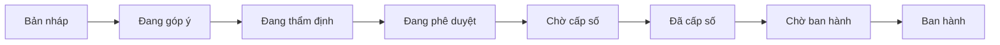
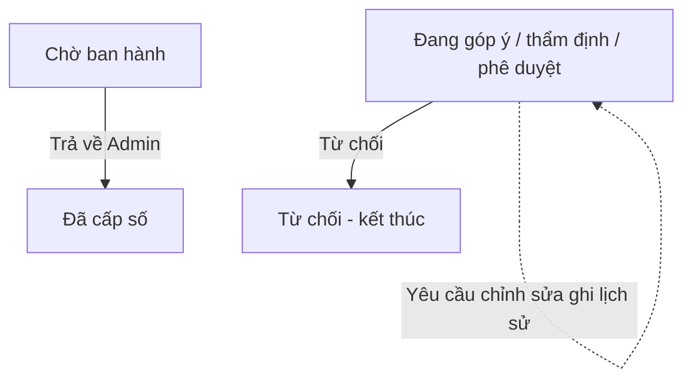

# Overview luồng trạng thái — Phát hành văn bản nội bộ (PHVB)

## Tóm tắt

Hệ thống **PHVB** quản lý toàn bộ vòng đời yêu cầu phát hành văn bản nội bộ trên SharePoint — từ lúc soạn thảo đến khi công bố chính thức.

Có **hai loại yêu cầu** chính:

- **Viết mới** — ban hành văn bản lần đầu
- **Điều chỉnh** — cập nhật văn bản đã ban hành trước đó

Cả hai loại đều đi chung **một quy trình phê duyệt và ban hành**, chỉ khác ở bước khởi tạo và cách xử lý khi công bố.

**Các vai trò tham gia:**

| Vai trò | Trách nhiệm chính |
|---------|-------------------|
| Người tạo yêu cầu | Soạn thảo, gửi yêu cầu, cập nhật khi được yêu cầu chỉnh sửa |
| Người góp ý | Cho ý kiến trước bước thẩm định (nếu được chỉ định) |
| Người thẩm định | Đánh giá nội dung, tính pháp lý |
| Người phê duyệt | Quyết định phê duyệt ban hành |
| Đơn vị cấp số (DC) | Gán số văn bản chính thức |
| Quản trị (Admin) | Chuẩn bị nội dung thông báo ban hành |
| Quản trị cấp cao (Super Admin) | Xác nhận và công bố văn bản |

---

## Luồng trạng thái chính

Sơ đồ dưới đây mô tả **luồng đi chuẩn** (happy path) từ khi tạo yêu cầu đến khi ban hành:

**Ghi chú:**

- Có thể **bỏ qua bước Góp ý** nếu không chỉ định người góp ý khi tạo yêu cầu.
- **Ban hành** là trạng thái cuối — văn bản được công bố chính thức và thông báo đến người nhận.

---

## Nhánh ngoại lệ

Trong quá trình góp ý, thẩm định hoặc phê duyệt, yêu cầu có thể rẽ nhánh như sau:

- **Từ chối:** trạng thái yêu cầu chuyển sang **Từ chối** — yêu cầu dừng lại, không tiếp tục xử lý.
- **Yêu cầu chỉnh sửa:** đây là **hành động ghi lịch sử** (activity log), **không** đổi trạng thái yêu cầu. Trạng thái vẫn giữ nguyên (Đang góp ý / Đang thẩm định / Đang phê duyệt); người tạo cập nhật nội dung trong cùng trạng thái hiện tại.
- **Trả về Admin:** Super Admin trả yêu cầu về bước Đã cấp số để Admin chỉnh sửa nội dung ban hành.

---

## Ai làm gì ở từng giai đoạn

| Giai đoạn | Trạng thái | Người / Bộ phận xử lý | Mô tả ngắn |
|-----------|------------|------------------------|------------|
| Soạn thảo | Bản nháp | Người tạo yêu cầu | Lưu nháp, chưa gửi đi xử lý |
| Phối hợp | Đang góp ý | Người được chỉ định góp ý | Cho ý kiến trước khi thẩm định |
| Thẩm định | Đang thẩm định | Người thẩm định | Đánh giá nội dung, tính pháp lý |
| Phê duyệt | Đang phê duyệt | Người phê duyệt | Quyết định phê duyệt ban hành |
| Cấp số | Chờ cấp số → Đã cấp số | Đơn vị cấp số (DC) | Gán số văn bản chính thức |
| Chuẩn bị ban hành | Chờ ban hành | Quản trị (Admin) | Soạn nội dung thông báo ban hành |
| Ban hành | Ban hành | Quản trị cấp cao (Super Admin) | Công bố văn bản, gửi thông báo |

---

## Viết mới vs Điều chỉnh

| | Viết mới | Điều chỉnh |
|---|----------|------------|
| **Mục đích** | Ban hành văn bản mới | Cập nhật văn bản đã ban hành |
| **Tài liệu đính kèm** | Bắt buộc có bản soạn thảo | Không bắt buộc |
| **Thư mục ban hành** | Tạo mới | Dựa trên văn bản cũ đã ban hành |
| **Khi ban hành** | Đăng bản mới lên hệ thống | Lưu trữ bản cũ, đăng bản điều chỉnh |
